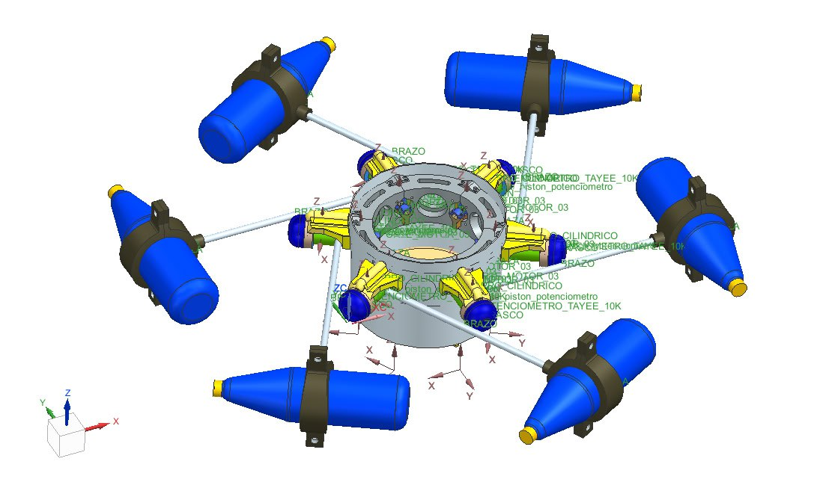

# OpenWEC-Lab

Open-source low-cost instrumentation platform for laboratory-scale wave energy converters.

OpenWEC-Lab is an open-source hardware and software platform developed for the experimental instrumentation of laboratory-scale wave energy converters (WECs). The platform integrates custom electronic hardware, embedded firmware, synchronized data acquisition, and data processing tools to support hydrodynamic, mechanical, inertial, and electrical measurements during wave tank experiments.

## SALUM Experimental Prototype

The experimental platform was validated using the SALUM seven-body articulated wave energy converter developed at Universidad Tecnológica de Bolívar.

## Repository Structure

### Firmware

ESP32 firmware for synchronized acquisition of inertial, electrical, encoder, and hydrodynamic variables.

### PCB

Electronic hardware including:

- Schematics
- PCB Layouts
- Gerber Files
- Bill of Materials (BOM)
- Images

### Documentation

Project figures and documentation.

## Applications

- Laboratory-scale wave energy converters
- Ocean renewable energy research
- Embedded instrumentation
- Experimental validation
- Open-source scientific hardware

## Citation

If you use this repository in your research, please cite it using the CITATION.cff file or the GitHub citation feature.
